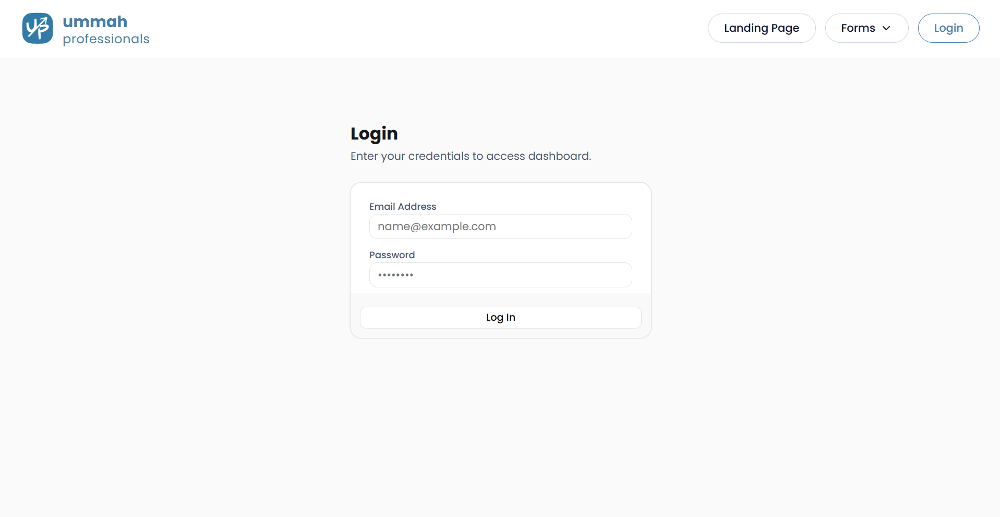
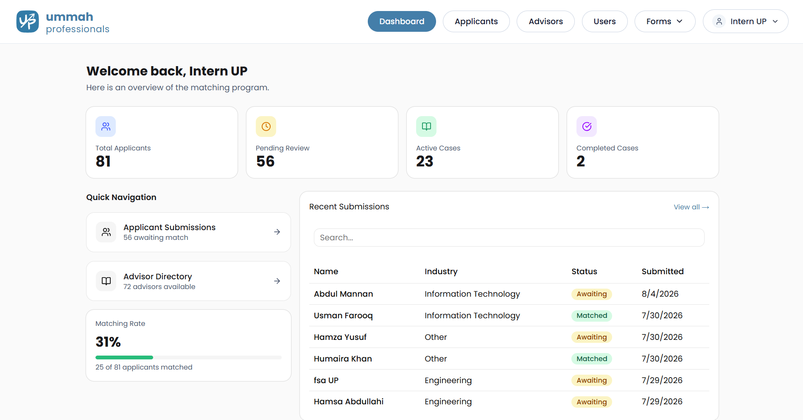
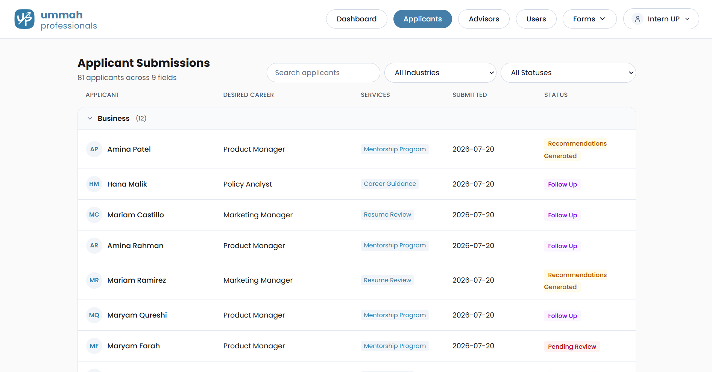
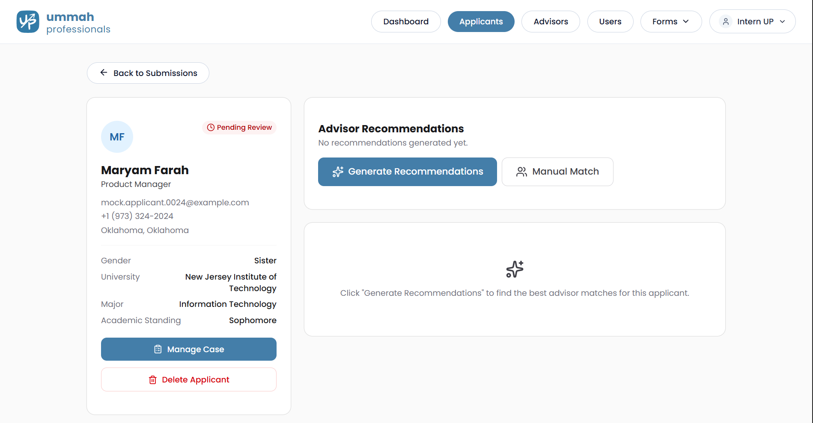
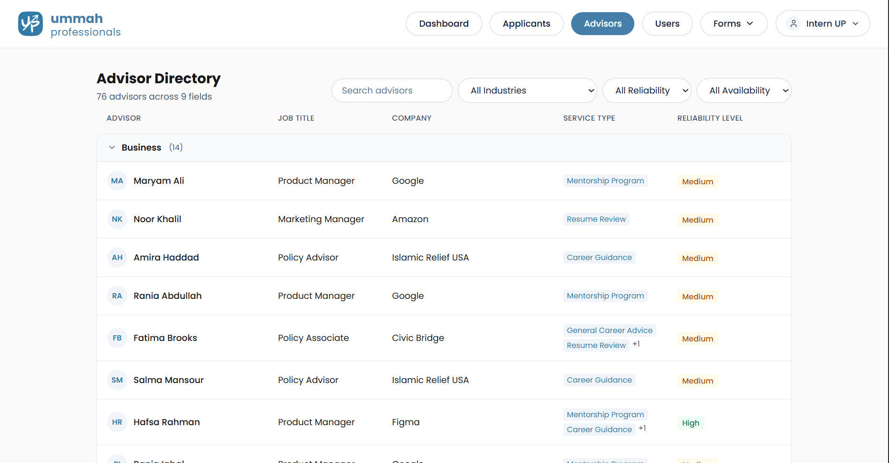
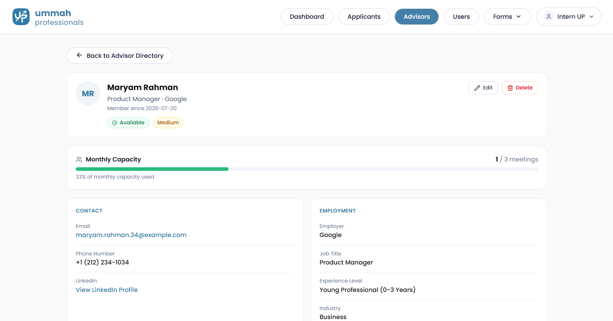
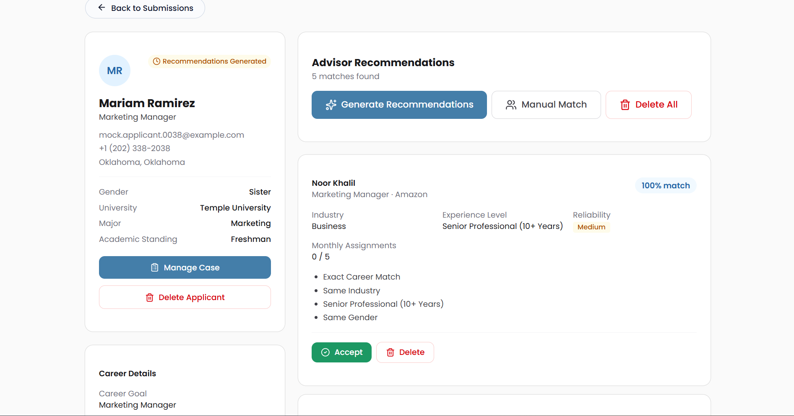
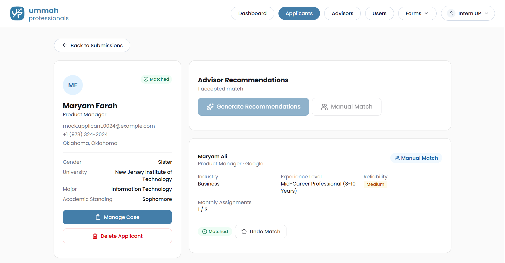
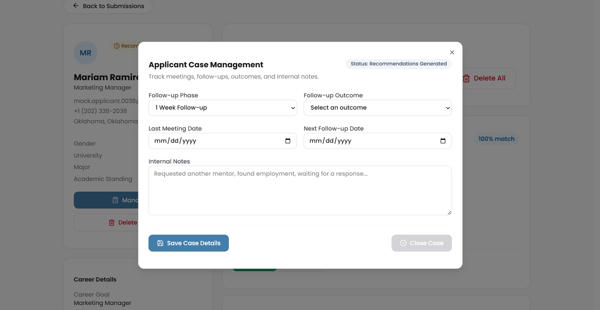

# User Manual

**Project:** Ummah Professionals Advisor Matching Platform  
**Version:** MVP 1.0  
**Last Updated:** August 2026

---

# Table of Contents

1. Introduction
2. User Roles
3. Logging In
4. Dashboard
5. Applicant Management
6. Advisor Management
7. AI Recommendation Engine
8. Manual Matching
9. Applicant Case Management
10. User Management (Admin Only)
11. Public Registration Forms
12. Profile Management
13. Frequently Asked Questions

---

# 1. Introduction

The Ummah Professionals Advisor Matching Platform is designed to streamline the advisor matching process for Ummah Professionals.

Instead of manually searching through advisor records, volunteers can use AI-assisted recommendations or manually assign advisors while managing the entire applicant journey from registration through follow-up.

The platform provides:

- Applicant Management
- Advisor Management
- AI Recommendation Engine
- Manual Matching
- Applicant Case Management
- User Management
- Dashboard & Analytics

---

# 2. User Roles

The system supports two volunteer roles.

## Admin

Administrators have full access to the platform.

Permissions include:

- Dashboard
- Applicant Management
- Advisor Management
- Recommendation Engine
- User Management
- Profile Management

---

## Staff

Staff members have access to all mentoring functionality except User Management.

Permissions include:

- Dashboard
- Applicant Management
- Advisor Management
- Recommendation Engine
- Profile Management

---

# 3. Logging In

1. Navigate to the Login page.
2. Enter your email address.
3. Enter your password.
4. Click **Login**.

After logging in, the navigation bar will display the features available for your role.

---

# 4. Dashboard

The dashboard provides an overview of the mentoring program.

The dashboard displays:

- Total Applicants
- Awaiting Match
- Active Mentorships
- Completed Cases
- Matching Rate

Additional dashboard widgets provide information about:

- Applicant activity
- Advisor activity
- Recommendation statistics

These values update automatically from the database.

---

# 5. Applicant Management

The Applicant page allows volunteers to view and manage applicant records.

Features include:

- Search applicants
- Filter by industry
- Filter by status
- View applicant profiles
- Delete applicant records (Admin/Staff)

---

## Applicant Profile

Each applicant has a dedicated profile page containing:

### Personal Information

- Name
- Email
- Phone Number
- County
- State

### Career Details

- Major
- Academic Standing
- Desired Career
- Industry
- Services Requested
- Referral Source
- Resume

### Recommendation Section

View:

- AI Recommendations
- Manual Matches
- Recommendation History

---

# 6. Advisor Management

The Advisor Directory allows volunteers to browse all registered advisors.

Features include:

- Search advisors
- Filter by industry
- Filter by availability
- Filter by reliability

---

## Advisor Profile

Each advisor profile displays:

### Personal Information

- Name
- Email
- Phone Number
- LinkedIn

### Professional Information

- Job Title
- Company
- Industry
- Years of Experience

### Capacity (Avoids Advisor Burnout)

- Monthly Capacity = Current Assignments / Number of assignments permitted in a month

### Availability

- Displays the advisor's status, advisors may be unavailable due to personal problems, events, or just on a break.
- This field is editable

### Reliability

- Displays the advisor's reliability level.
- This field is editable

---

# 7. AI Recommendation Engine

The Recommendation Engine helps volunteers identify suitable advisors.

Recommendations are generated using:

- Job Title Similarity
- Industry Match
- Advisor Experience
- Gender Preference (when applicable)

The system generates the Top 5 recommendations for each applicant.

Each recommendation includes:

- Match Score
- Career Similarity Explanation
- Advisor Details

Volunteers may:

- Accept a recommendation
- Delete recommendations
- Regenerate recommendations

---

# 8. Manual Matching

Volunteers may manually assign an advisor instead of using AI recommendations.

The Manual Matching interface allows volunteers to:

- Search advisors
- Filter advisors
- Review advisor information
- Assign an advisor directly

Manual matching follows the same business rules as AI-generated matches.

---

# 9. Applicant Case Management

Applicant Case Management allows volunteers to track applicants throughout their mentoring journey.

Editable fields include:

- Meeting Date
- Follow-up Stage
- Follow-up Outcome
- Internal Notes

Applicant statuses include:

- Pending Review
- Recommendations Generated
- Matched
- Follow-up
- Closed

These statuses help volunteers understand where each applicant is within the mentoring process.

---

# 10. User Management (Admin Only)

Only Administrators have access to User Management.

Administrators can:

- View users
- Create new users
- Delete users
- Manage roles
- Verify email status

---

# 11. Public Registration Forms

The platform includes two public registration forms.

## Applicant Registration Form

Applicants submit:

- Personal Information
- Academic Information
- Desired Career
- Resume
- Services Requested
- Referral Source

---

## Advisor Registration Form

Advisors submit:

- Personal Information
- Professional Information
- Job Title
- Industry
- Availability
- Reliability
- LinkedIn
- Phone Number

---

# 12. Profile Management

Authenticated users can access their Profile from the navigation bar.

The Profile page allows users to:

- Update their name
- Change their password
- View their email address
- View account role
- View email verification status

---

# 13. Frequently Asked Questions

## Why can't I access User Management?

Only Administrators have permission to manage user accounts.

---

## Why doesn't an advisor appear in manual search?

The advisor may:

- Be unavailable
- Be filtered by search criteria

---

## Can I manually override AI recommendations?

Yes.

Volunteers can always choose to manually assign any suitable advisor.

---

## Can an applicant have additional mentoring sessions?

Yes.

Applicants may request additional sessions during follow-up, and volunteers may generate new recommendations or manually assign another advisor.

---

## What happens after a mentoring session?

Volunteers update the applicant's case using the Applicant Case Management section.

The applicant may:

- Continue through follow-up
- Request an additional session
- Be marked as Closed once their mentoring journey is complete.

---

# Support

For technical issues or questions regarding the platform, please contact the project team.

---

**End of User Manual**